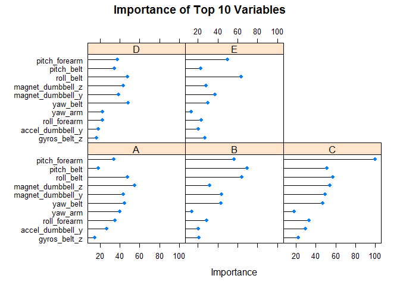

# 


## Weight Lifting Exercise Prediction To Quantified Self Movement Data Analysis Report

Lau Heng Kar

January 31, 2016 (Practical Machine Learning Course Project)

## Introduction

Using devices such as Jawbone Up, Nike FuelBand, and Fitbit it is now possible to collect a large amount of data about personal activity relatively inexpensively. 
These type of devices are part of the quantified self movement – a group of enthusiasts who take measurements about themselves regularly to improve their health, 
to find patterns in their behavior, or because they are tech geeks. One thing that people regularly do is quantify how much of a particular activity they do, but they rarely quantify how well they do it. 
In this project, your goal will be to use data from accelerometers on the belt, forearm, arm, and dumbell of 6 participants. 
They were asked to perform barbell lifts correctly and incorrectly in 5 different ways. More information is available from the website here: 
http://groupware.les.inf.puc-rio.br/har (see the section on the Weight Lifting Exercise Dataset).

## Download and Loading Data

The training data for this project are available here:

https://d396qusza40orc.cloudfront.net/predmachlearn/pml-training.csv

The test data are available here:

https://d396qusza40orc.cloudfront.net/predmachlearn/pml-testing.csv


```r
downloadData <- function() {
    # if training file is not exist, then download from web
    if (!file.exists("pml-training.csv")) {
        fileURL <- "https://d396qusza40orc.cloudfront.net/predmachlearn/pml-training.csv"
        download.file(fileURL, destfile=("pml-training.csv"))
        list.files(".")
    }
    
    # if training file is not exist, then download from web
    if (!file.exists("pml-testing.csv")) {
        fileURL <- "https://d396qusza40orc.cloudfront.net/predmachlearn/pml-testing.csv"
        download.file(fileURL, destfile=("pml-testing.csv"))
        list.files(".")
    }    
}

# Step 1: Download and Loading Data
downloadData()
training_Raw <- read.csv("pml-training.csv")
testing_Raw <- read.csv("pml-testing.csv")
```

## Basic summary of the RAW Data


```r
# Step 2: Basic sumarry of Raw Data
dim(training_Raw)           # result hidden
dim(testing_Raw)            # result hidden

str(training_Raw)           # result hidden
str(testing_Raw)            # result hidden

summary(training_Raw)       # result hidden
summary(testing_Raw)        # result hidden

table(training_Raw$classe, training_Raw$classe)  # result hidden
```

The training data set contains **19622** observations and **160** variables, while the testing data set contains **20** observations and **160** variables. The "classe" variable in the training set is the outcome to predict.

## Preparing and Cleaning the data


```r
# Step 3: Cleaning data
# In this step, we will clean the data and get rid of observations with missing values 
# as well as some meaningless variables.
sum(complete.cases(training_Raw))
```

```
## [1] 406
```

```r
sum(complete.cases(testing_Raw))
```

```
## [1] 0
```

```r
# Step 4: Feature extraction of data
# In this step, we will only extract column that has value for our feature selection

training_FeatureSelected <- training_Raw[, colSums(is.na(training_Raw)) == 0]
# training_FeatureRemoved <- training_Raw[, colSums(is.na(training_Raw)) > 0]

testing_FeatureSelected <- testing_Raw[, colSums(is.na(testing_Raw)) == 0]
# testing_FeatureRemoved <- testing_Raw[, colSums(is.na(testing_Raw)) > 0]

# remove X|timestamp|window non relevant features
features <- names(testing_FeatureSelected[,colSums(is.na(testing_FeatureSelected))==0])[8:59]

# updated selected feature for training and testing
training_FeatureSelected <- training_Raw[, c(features, "classe")]
testing_FeatureSelected <- testing_Raw[,c(features, "problem_id")]

# free up more memory for later usage
rm(training_Raw)
rm(testing_Raw)
rm(features)
rm(downloadData)
```

## Exploring and Basic summary of the CLEAN data


```r
# Step 5: Basic sumarry of Clean up Data 
str(training_FeatureSelected)       # result hidden
summary(training_FeatureSelected)   # result hidden
```


```r
# training and testing data set observations and variables
dim(training_FeatureSelected)
```

```
## [1] 19622    53
```

```r
dim(testing_FeatureSelected)
```

```
## [1] 20 53
```

```r
# feature extracted for training and testing data set are the same except for classe and problem_id
names(training_FeatureSelected) 
```

```
##  [1] "roll_belt"            "pitch_belt"           "yaw_belt"            
##  [4] "total_accel_belt"     "gyros_belt_x"         "gyros_belt_y"        
##  [7] "gyros_belt_z"         "accel_belt_x"         "accel_belt_y"        
## [10] "accel_belt_z"         "magnet_belt_x"        "magnet_belt_y"       
## [13] "magnet_belt_z"        "roll_arm"             "pitch_arm"           
## [16] "yaw_arm"              "total_accel_arm"      "gyros_arm_x"         
## [19] "gyros_arm_y"          "gyros_arm_z"          "accel_arm_x"         
## [22] "accel_arm_y"          "accel_arm_z"          "magnet_arm_x"        
## [25] "magnet_arm_y"         "magnet_arm_z"         "roll_dumbbell"       
## [28] "pitch_dumbbell"       "yaw_dumbbell"         "total_accel_dumbbell"
## [31] "gyros_dumbbell_x"     "gyros_dumbbell_y"     "gyros_dumbbell_z"    
## [34] "accel_dumbbell_x"     "accel_dumbbell_y"     "accel_dumbbell_z"    
## [37] "magnet_dumbbell_x"    "magnet_dumbbell_y"    "magnet_dumbbell_z"   
## [40] "roll_forearm"         "pitch_forearm"        "yaw_forearm"         
## [43] "total_accel_forearm"  "gyros_forearm_x"      "gyros_forearm_y"     
## [46] "gyros_forearm_z"      "accel_forearm_x"      "accel_forearm_y"     
## [49] "accel_forearm_z"      "magnet_forearm_x"     "magnet_forearm_y"    
## [52] "magnet_forearm_z"     "classe"
```

```r
names(testing_FeatureSelected)
```

```
##  [1] "roll_belt"            "pitch_belt"           "yaw_belt"            
##  [4] "total_accel_belt"     "gyros_belt_x"         "gyros_belt_y"        
##  [7] "gyros_belt_z"         "accel_belt_x"         "accel_belt_y"        
## [10] "accel_belt_z"         "magnet_belt_x"        "magnet_belt_y"       
## [13] "magnet_belt_z"        "roll_arm"             "pitch_arm"           
## [16] "yaw_arm"              "total_accel_arm"      "gyros_arm_x"         
## [19] "gyros_arm_y"          "gyros_arm_z"          "accel_arm_x"         
## [22] "accel_arm_y"          "accel_arm_z"          "magnet_arm_x"        
## [25] "magnet_arm_y"         "magnet_arm_z"         "roll_dumbbell"       
## [28] "pitch_dumbbell"       "yaw_dumbbell"         "total_accel_dumbbell"
## [31] "gyros_dumbbell_x"     "gyros_dumbbell_y"     "gyros_dumbbell_z"    
## [34] "accel_dumbbell_x"     "accel_dumbbell_y"     "accel_dumbbell_z"    
## [37] "magnet_dumbbell_x"    "magnet_dumbbell_y"    "magnet_dumbbell_z"   
## [40] "roll_forearm"         "pitch_forearm"        "yaw_forearm"         
## [43] "total_accel_forearm"  "gyros_forearm_x"      "gyros_forearm_y"     
## [46] "gyros_forearm_z"      "accel_forearm_x"      "accel_forearm_y"     
## [49] "accel_forearm_z"      "magnet_forearm_x"     "magnet_forearm_y"    
## [52] "magnet_forearm_z"     "problem_id"
```

```r
table(training_FeatureSelected$classe, training_FeatureSelected$classe)
```

```
##    
##        A    B    C    D    E
##   A 5580    0    0    0    0
##   B    0 3797    0    0    0
##   C    0    0 3422    0    0
##   D    0    0    0 3216    0
##   E    0    0    0    0 3607
```

Now, the cleaned training data set contains **19622** observations and **53** variables, while the testing data set contains **20** observations and **53** variables. The "classe" variable is still in the cleaned training set.

## Preparing data for training, testing and cross validation


```r
# Step 6: Preparing data for training, testing and cross validation
# We can split the cleaned training set into a pure training data set (70%) and 
# a validation data set (30%). We will use the validation data set to 
# conduct cross validation in future steps.
library(caret)
inTrain <- createDataPartition(y=training_FeatureSelected$classe, p=0.70, list=FALSE)
training <- training_FeatureSelected[inTrain,]
validation <- training_FeatureSelected[-inTrain,]
dim(training)
```

```
## [1] 13737    53
```

```r
# free up more memory for later usage
rm(training_FeatureSelected)
```

## Regression Analysis


```r
# Step 7a: Try out linear regression first
# Step 7a: Using step to Choose a model by AIC in a Stepwise Algorithm
# Step 7b: Using anova

# but due to memory usage and compute time, skip LM and use Random Forest Model instead

# start.time <- Sys.time()
# modelfit_LM <- lm(classe ~ ., data = training)
# summary(modelfit_LM)
# end.time <- Sys.time()
# time.taken <- end.time - start.time
# message("LM time taken: ", time.taken)

# start.time <- Sys.time()
# modelfit_LM <- step(modelfit_LM, direction = "both")
# summary(modelfit_LM)
# end.time <- Sys.time()
# time.taken <- end.time - start.time
# message("LM AIC time taken: ", time.taken)
```

Linear Regression Algorithm should be the fist model to try. We **skip** Linear Regression algorithm due to memory usage for later use and compute time of report.

## Model Train


```r
# Step 8: Try out different machine learning model
## Random Forest Model
## GBM Model
## lda Model

## set ntree = 30 due to memory usage and compute time
start.time <- Sys.time()
trainCntr <- trainControl("oob")
#modelFit_RF <- train(classe ~ ., data = training, method = "rf", ntree=200, importance=T, trControl=trainCntr)
#modelFit_RF <- train(classe ~ ., data = training, method = "rf", ntree=50, importance=T, trControl=trainCntr)
modelFit_RF <- train(classe ~ ., data = training, method = "rf", ntree=30, importance=T, trControl=trainCntr)
end.time <- Sys.time()
time.taken <- end.time - start.time
message("Random Forest Model time taken: ", time.taken)

## GBM Model
# start.time <- Sys.time()
# modelFit_GBM <- train(classe ~., data = training, method = "gbm")    
# end.time <- Sys.time()
# time.taken <- end.time - start.time
# message("GBM Model time taken: ", time.taken)

## lda Model
# start.time <- Sys.time()
# modelFit_LDA <- train(classe ~., data = training, method = "lda")  
# end.time <- Sys.time()
# time.taken <- end.time - start.time
# message("lda Model time taken: ", time.taken)

# free up more memory
rm(training)
```

We fit a predictive model for activity recognition using **Random Forest Algorithm** because it automatically selects important variables and is robust to correlated covariates & outliers in general. We will use **ntree = 30** when applying the algorithm due to memory usage and compute time.

## Model Validation and Confusion Matrix 


```r
prediction_RF <- predict(modelFit_RF, validation)
#prediction_GBM <- predict(modelFit_GBM, validation)
#prediction_LDA <- predict(modelFit_LDA, validation)

confusionMatrix(prediction_RF, validation$classe)
```

```
## Confusion Matrix and Statistics
## 
##           Reference
## Prediction    A    B    C    D    E
##          A 1674   14    0    0    0
##          B    0 1123    7    3    0
##          C    0    2 1018    6    0
##          D    0    0    1  955    4
##          E    0    0    0    0 1078
## 
## Overall Statistics
##                                           
##                Accuracy : 0.9937          
##                  95% CI : (0.9913, 0.9956)
##     No Information Rate : 0.2845          
##     P-Value [Acc > NIR] : < 2.2e-16       
##                                           
##                   Kappa : 0.992           
##  Mcnemar's Test P-Value : NA              
## 
## Statistics by Class:
## 
##                      Class: A Class: B Class: C Class: D Class: E
## Sensitivity            1.0000   0.9860   0.9922   0.9907   0.9963
## Specificity            0.9967   0.9979   0.9984   0.9990   1.0000
## Pos Pred Value         0.9917   0.9912   0.9922   0.9948   1.0000
## Neg Pred Value         1.0000   0.9966   0.9984   0.9982   0.9992
## Prevalence             0.2845   0.1935   0.1743   0.1638   0.1839
## Detection Rate         0.2845   0.1908   0.1730   0.1623   0.1832
## Detection Prevalence   0.2868   0.1925   0.1743   0.1631   0.1832
## Balanced Accuracy      0.9983   0.9919   0.9953   0.9948   0.9982
```

```r
#confusionMatrix(prediction_GBM, validation$classe)
#confusionMatrix(prediction_LDA, validation$classe)
```

## Model Test - Prediction and Result


```r
prediction_RF.Testing <- predict(modelFit_RF, testing_FeatureSelected)
prediction_RF.Testing
```

```
##  [1] B A B A A E D B A A B C B A E E A B B B
## Levels: A B C D E
```

## Plot Assess Number of relevant variables


```r
# Assess Number of relevant variables
varImpObj <- varImp(modelFit_RF)

# Top 10 plot
plot(varImpObj, main = "Importance of Top 10 Variables", top = 10)
```

 
